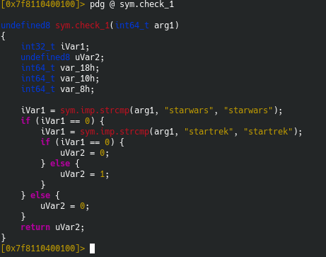
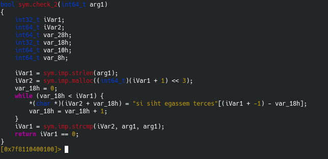
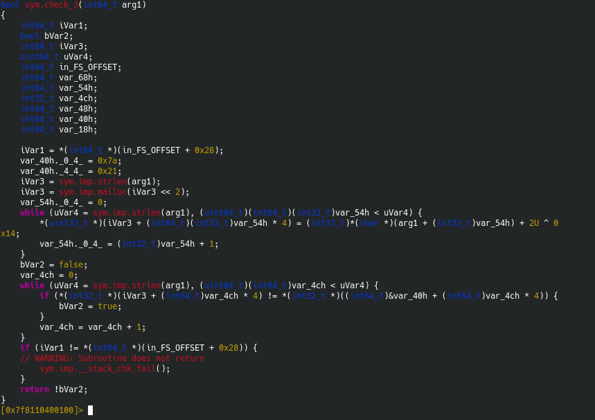

# Cracker Barrel (50 points at the end)

## Question

I found a USB drive under the checkers board at cracker barrel. My friends told me not to plug it in but surely nothing bad is on it?

I found this file, but I can't seem to unlock it's secrets. Can you help me out?

Also.. once you think you've got it I think you should try to connect to challenges.auctf.com at port 30000 not sure what that means, but it written on the flash drive..

Original Author: nadrojisk

## Long Writeup 

There's a section called check, which uses three parts (check_1, check_2, and check_3).

Keep in mind that the CTF uses sym.remove_newline, which basically changes '\n' to '\0'. Therefore, if there are two opposing things, just type the first one, and the second one does **NOT** matter since `strcmp` only checks till the next '\0'. 

So, here's `check_1`:

This checks if arg1 is equal to "starwars", and then exits if it's true.

Here's `check_2`:

Basically checks if arg1 is equal to the reverse of "si siht egassem terces", which i "secret message this is"

Here's `check_3`:

This runs two loops:

One, that compares the values of each element of the array `arg1` with an array iVar3 with an offset of 22.
In the second loop, the checking function gives `true` when the check is not equal. (The required boolean is `false` here).

Since the check is only for the length of the input, we can input whatever little input we want to.

So, finding the value of `chr(0x7a - 2^0x14)`, we have lowercase "l". This is the third input.

And that gives us the flag.
