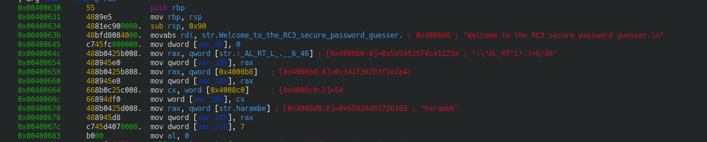
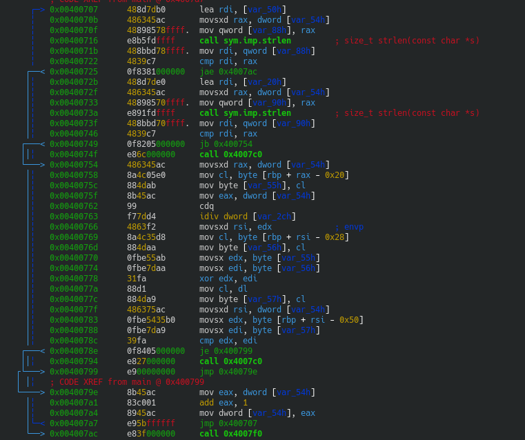
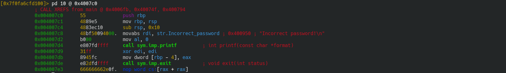
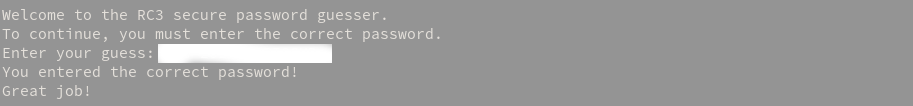

# Writeup: LogMeIn from RC3 CTF 2016

## TL;DR: Repeating-key XOR

## Detailed writeup:
If you open the binary with radare2, you will find two peculiar strings. ':\"AL_RT^L*.?+6/46' and 'harambe'. While one of them is a stale meme, the other one makes no sense.

That is, until you see the rest of the code.

Everything until the `strlen`s is just printing stuff and asking for the password. The said password here, is stored in memory, in [var_20h], while ':\"AL_RT^L*.?+6/46' is stored in [var_50h]. 

And so, the two strlens take the size of ':\"AL_RT^L*.?+6/46' (17) and the input and compare it in `cmp rsi, rax`. When `jae` (Jump if Above or Equal) is called, it checks the value of Carry Flag, and if it's zero, it jumps.

## The loop

We can figure out what `call 0x4007c0` by using pd 10 @ `0x4007c0`. That gives us this output:

Conforming to the jargon used in the reversing community, I'm gonna call this the badboy.

So usually, in these kinda challenges, they check two things. If the length of the input is wrong, the flag that we have input is wrong. And if the decrypted text is not equal to the input, the flag is wrong.

Since the next instructions are in a loop, I'm expecting it to decrypt each character of the encrypted flag and check with the input.

From `0x00400707` to `0x00400722`, the program Loads the Effective Address of [var_50h], our encrypted flag to rdi, which it then uses to call `strlen()`. But since strlen's output is `rax`, and we need rax to hold the counter, it's backed up in [var_88h]. Then the backup is copied to rdi, and it's compared with `rax`, which is the output of strlen(). When it is true that the loop hasn't basically finished, the further instructions are executed.

From `0x0040072b` to `0x00400746`, the program checks if value of the counter is equal to the length of the encrypted flag. If [var_54h] is lesser than strlen() of the encrypted flag, the program continues execution. Otherwise, the badboy is called.

From `0x00400754` to `0x0040078e`, the program basically takes one character of the input, and one character of "harambe". They're XORed together and the output is compared with the corresponding character of the encrypted flag. If it's true (i.e. they're the same), then [var_54h] is incremented by one.

This program is basically a repeating-XOR, and the exploit is left as an exercise to the reader.

## The correct output

